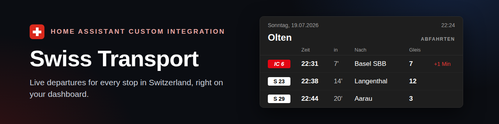
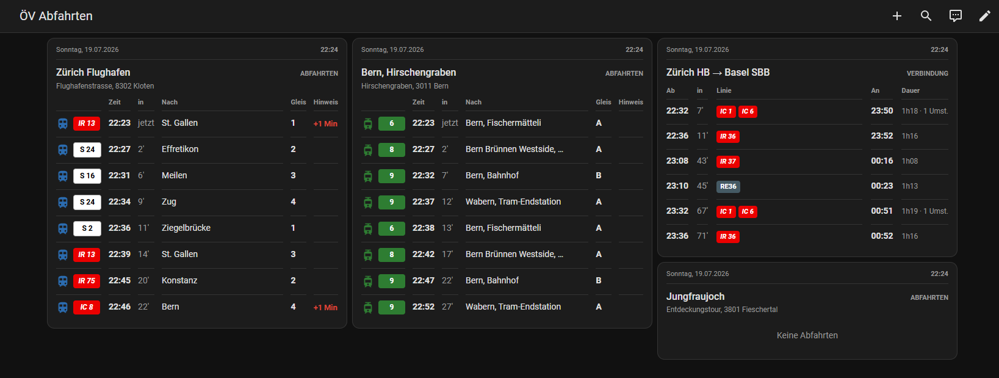

# Swiss Transport



[](https://github.com/hacs/integration)
[](LICENSE)
<a href="https://www.buymeacoffee.com/prusuino"></a>

A Home Assistant custom integration for Swiss public transport, sourced from the free public **transport.opendata.ch** timetable API (backed by search.ch, no account required). Two things it does:

- **Departure boards** — the live Abfahrtstafel of any station (train, tram, bus, ship, cableway).
- **Connections** — a saved route (from → to), e.g. your daily commute, showing the next departures with times, platforms, duration and transfers.
- **Optional real-time** — plug in a free [opentransportdata.swiss](#real-time-optional) token for fresher delays, cancellations, platform changes, disruption messages and occupancy.

Both come with a bundled Lovelace card styled like a station departure board, and an auto-generated dashboard.



## What it provides

When you add the integration you first choose a **mode** — a departure board of a station, or a saved connection (from → to). Repeat for as many stations/routes as you like; each becomes its own device.

### Departure board

| Entity | Type | Description |
|---|---|---|
| `sensor.swiss_transport_<station>` | Sensor | State = the next departure (timestamp). Attributes: `departures` (the full upcoming board — line, category, destination, platform, delay, operator, departure time, plus `cancelled`/`occupancy` when real-time is enabled), `departure_count`, station name, **address** (reverse-geocoded), coordinates, `realtime` (bool) and `alerts` (disruption messages, real-time only). |

### Connection (from → to)

| Entity | Type | Description |
|---|---|---|
| `sensor.swiss_transport_<from>_<to>` | Sensor | State = the next connection's departure (timestamp). Attributes: `connections` (each with departure/arrival time and platform, delay, `duration_min`, `transfers`, and the `products`/lines used), `connection_count`, from/to names. |

Data refreshes about every 90 seconds.

## Bundled Lovelace cards

The integration ships two self-registering cards (no manual resource setup), both with a visual editor:

**`swiss-transport-card`** — a real departure board, laid out like a station display: **symbol · time · countdown · destination · platform · info**, with a live date/time bar on top and an "Abfahrten" label. Colored **line badges** matching the Swiss product scheme (S-Bahn white chip, IC/IR family red, tram/bus/ship/cableway in their mode color) with a transport-mode icon. The platform column is dropped for bus/tram stops; delays show in red. When the optional [real-time source](#real-time-optional) is enabled, cancelled departures are struck through and marked, a disruption banner appears, and an occupancy column is shown when data is available.

```yaml
type: custom:swiss-transport-card
entity: sensor.swiss_transport_<station>
title: Zürich HB      # optional
rows: 8               # optional, max departures shown
show_clock: true      # optional, show the date/time bar
show_type: true       # optional, show the "Departures" label
show_occupancy: true  # optional, show the occupancy column (real-time only)
show_alerts: true     # optional, show the disruption banner (real-time only)
max_alerts: 3         # optional, disruptions shown before "+N more" (0 = all)
```

**`swiss-transport-connection-card`** — a board for a saved route: **departure · countdown · line(s) · arrival · duration/transfers**, with the same date/time bar and a "Verbindung" label.

```yaml
type: custom:swiss-transport-connection-card
entity: sensor.swiss_transport_<from>_<to>
title: Olten → Zürich HB   # optional
```

Both the date/time bar and the type label can be toggled off in the visual editor.

## Options

Via the integration's Configure dialog you can change the **number of departures/connections**, and for a station board restrict the **transport types** shown (train / tram / bus / ship / cableway). Changes apply immediately.

## Real-time (optional)

By default all data — including delays — comes from transport.opendata.ch, which reports delays but not reliably cancellations. You can **optionally** enrich station boards with the official **Open Journey Planner (OJP 2.0)** real-time feed from [opentransportdata.swiss](https://opentransportdata.swiss/), which adds:

- **fresher, second-accurate delays**,
- **cancellations** (struck-through and marked on the board),
- **platform changes**,
- **disruption messages** (shown as a banner), and
- **occupancy** forecasts (shown as a column when available).

This is completely optional. Without a token nothing changes and everything keeps working from transport.opendata.ch.

### Getting a token (free)

The token is free. On [opentransportdata.swiss](https://opentransportdata.swiss/) → **API Manager**:

1. Log in (create an account if needed).
2. Choose the **OJP 2.0** API and open it.
3. Click **Access with this plan** and select (or create) an app — give it a name and description.
4. Open the app under **my apps** and copy the **TOKEN** (the *Token Hash* is **not** needed).

The current OJP 2.0 plan allows 20 000 calls/day and 50 calls/minute — far more than this integration needs (it makes one call per station per ~90 s refresh).

### Enabling it

Paste the token into the **Real-time token** field when adding a station, or later via the station's **Configure** dialog. Entered once, it enriches **every** station board. Leave it empty to use transport.opendata.ch only.

> Note: the token is a credential — treat it like a password. It is stored in Home Assistant like any other integration secret and never leaves your instance except in requests to opentransportdata.swiss.

## Automatic dashboard

On first setup, the integration automatically creates an **"ÖV Abfahrten" / "Departures"** dashboard (localized) and adds the matching card for every station or connection you configure. Add another one and its card appears there automatically; remove it and its card is cleaned up. It's created only once — if you customize or delete the dashboard yourself, the integration won't touch or re-create it.

## Language

Entity names and card labels follow your Home Assistant language — German, English, French, and Italian, with English as the fallback.

## Installation

### HACS (recommended)

1. In HACS, go to **Integrations → ⋮ → Custom repositories**, add this repository URL with category **Integration**.
2. Search for **"Swiss Transport"** and install.
3. Restart Home Assistant.

### Manual

1. Copy the `custom_components/swiss_transport` folder into your Home Assistant `config/custom_components/` directory.
2. Restart Home Assistant.

## Setup

1. **Settings → Devices & Services → Add Integration**, search for **"Swiss Transport"**.
2. Choose a mode:
   - **Departure board** — type part of a station name (e.g. "Bern", "Zürich HB", "Luzern, Bahnhof"), pick the exact stop, set how many departures to show, optionally limit the transport types.
   - **Connection (from → to)** — type both station names, pick the exact stops, set how many connections to show. Great for a daily commute (add the reverse direction as a second connection for the way back).
3. Done — add the integration again for another station or route.

## Notes

- Only relevant for stops within Switzerland (and directly connected cross-border stations covered by the Swiss timetable).
- transport.opendata.ch is a free community service with rate limits — the integration polls conservatively (~90 s). Without the optional real-time source, delays depend on that feed's own reporting and cancellations are not shown.
- Unofficial; not affiliated with Opendata.ch, search.ch, opentransportdata.swiss, OpenStreetMap, or any transport operator.

## Data source & license

Source code: MIT — see [LICENSE](LICENSE). Data sources and their required attribution — timetable & departures from transport.opendata.ch (search.ch), optional real-time from opentransportdata.swiss (OJP), and station addresses from OpenStreetMap contributors (ODbL) — are documented in [NOTICE.md](NOTICE.md). Every entity sets Home Assistant's `attribution` attribute to credit the sources actually used.

## Disclaimer

This integration is provided **as-is, without any warranty**. Timetable and real-time data come from a third-party service and may be inaccurate, delayed, incomplete, or unavailable. Do not rely on it as your sole source for catching a connection — always check official displays. The author(s) accept **no responsibility or liability** for any missed connection, damage, or loss arising from using this integration.

## Support

If this integration is useful to you, you can support its development:

<a href="https://www.buymeacoffee.com/prusuino"></a>
